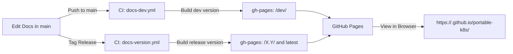

# Portable k8s

Documentation as I build out a platform that is highly portable and avoids vendor lock-in, managed control plane, docker etc etc.

---

## Day-to-Day Docs Workflow

This project uses [MkDocs Material](https://squidfunk.github.io/mkdocs-material/) with [mike](https://github.com/jimporter/mike) for versioned documentation hosted on GitHub Pages.  
`main` branch holds the source markdown; `gh-pages` branch holds the built site.

---

### 📂 Branch & Deploy Flow



---

### Local Preview

1. Create and activate your Python virtual environment:

   ```bash
   python -m venv .venv
   source .venv/bin/activate
   ```
2. Install dependencies:

   ```bash
   pip install -r requirements.txt
   ```
3. Run local preview (unversioned):

   ```bash
   mkdocs serve
   ```
4. Or run local preview (versioned, e.g., for `dev`):

   ```bash
   mike deploy dev
   mike serve
   ```

   * Open: `http://127.0.0.1:8000/dev/`

---

### Publish a Development Build

* **When**: Any time you push to `main`
* **What Happens**: GitHub Actions builds and publishes `/dev/` to GitHub Pages (`gh-pages` branch).
* **URL**:

  ```
  https://<username>.github.io/portable-k8s/dev/
  ```

---

### Cut a New Release Version

1. Make sure `main` is up-to-date and all changes are committed.
2. Tag the release (choose your version number):

   ```bash
   git tag -a v0.2.0 -m "docs: release 0.2.0"
   git push origin v0.2.0
   ```
3. GitHub Actions will:

   * Build `/0.2/`
   * Move `/latest/` to point to `0.2`
   * Set `0.2` as the default version
4. **Site URLs after release:**

   * Default:

     ```
     https://<username>.github.io/portable-k8s/
     ```

     (redirects to `/latest/`)
   * Specific version:

     ```
     https://<username>.github.io/portable-k8s/0.2/
     ```

---

### Check Versions

To list published versions from `gh-pages`:

```bash
mike list --branch gh-pages
```

Example output:

```
0.1
0.2
dev
latest -> 0.2
```


