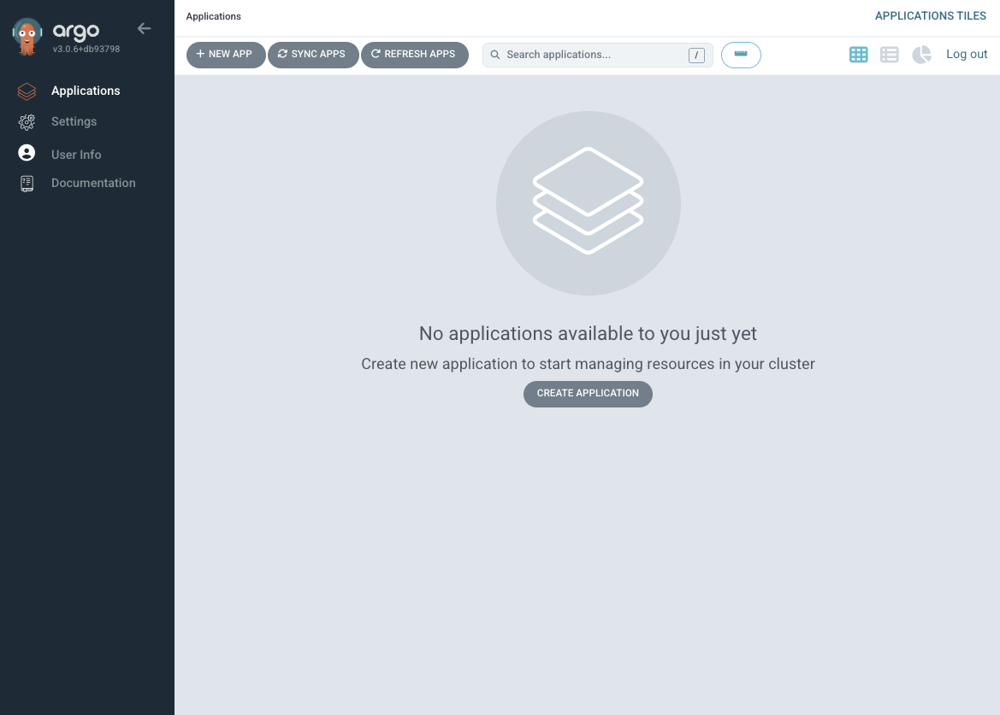

# Local Development Environment Setup

This guide documents the setup of a local Kubernetes development environment on macOS using Colima, K3s, and essential cloud-native tools.

## Phase 1: Local Kubernetes with GitOps

### Prerequisites

#### Step 1: Homebrew Package Manager 

Homebrew is required for installing all the tools in this guide.

**Check Installation:**
```bash
brew --version
```

**Expected Output:**
```
Homebrew 4.x.x
```

**Status:**  Installed (Version 4.6.3)

If Homebrew is not installed, run:
```bash
/bin/bash -c "$(curl -fsSL https://raw.githubusercontent.com/Homebrew/install/HEAD/install.sh)"
```

---

### Step 2: Install Colima

Colima provides a lightweight container runtime with Kubernetes support via K3s.

**Installation:**
```bash
brew install colima
```

**Verify Installation:**
```bash
colima version
```

**Expected Output:**
```
colima version 0.x.x
git commit: <commit-hash>
```

**Status:** ✅ Installed (Version 0.8.4)

---

### Step 3: Install Docker CLI

Docker CLI is required for Colima to provide container runtime functionality.

**Installation:**
```bash
brew install docker
```

**Verify Installation:**
```bash
docker --version
```

**Expected Output:**
```
Docker version xx.x.x, build xxxxxxx
```

**Status:** ✅ Installed (Version 28.3.3)

**Note:** This installs only the Docker CLI, not Docker Desktop. Colima will provide the Docker daemon.

---

### Step 4: Install kubectl

kubectl is the command-line tool for interacting with Kubernetes clusters.

**Installation:**
```bash
brew install kubectl
```

**Verify Installation:**
```bash
kubectl version --client
```

**Expected Output:**
```
Client Version: v1.xx.x
Kustomize Version: vx.x.x
```

**Status:** ✅ Installed (Version 1.33.3)

---


### Step 5: Install Tilt

Tilt enables fast local Kubernetes development with automatic rebuilds and live updates.

**Installation:**
```bash
brew install tilt
```

**Verify Installation:**
```bash
tilt version
```

**Expected Output:**
```
v0.x.x, built yyyy-mm-dd
```

**Status:** ✅ Installed (Version 0.35.0)

---

### Step 6: Install ArgoCD CLI

ArgoCD CLI for managing GitOps deployments from the command line.

**Installation:**
```bash
brew install argocd
```

**Verify Installation:**
```bash
argocd version --client
```

**Expected Output:**
```
argocd: vx.x.x+xxxxxxx
  BuildDate: yyyy-mm-dd
  GitCommit: xxxxxxx
  Platform: darwin/arm64
```

**Status:** ✅ Installed (Version 3.0.12)

---

### Step 7: Install Azure CLI

Azure CLI for managing Azure resources and AKS clusters (needed for later phases).

**Installation:**
```bash
brew install azure-cli
```

**Verify Installation:**
```bash
az version
```

**Expected Output:**
```
azure-cli                         2.xx.x
core                              2.xx.x
telemetry                          x.x.x
...
```

**Status:** ✅ Installed (Version 2.76.0)

---

## Starting the Local Kubernetes Cluster

### Step 8: Start Colima with Kubernetes

Start Colima with K3s Kubernetes and Docker runtime.

**Start Colima:**
```bash
colima start --kubernetes --cpu 6 --memory 12 --disk 60
```

This will:
- Create a Colima VM with 6 CPUs, 12GB RAM, and 60GB disk
- Install Docker daemon inside the VM
- Install K3s Kubernetes
- Configure kubectl context

**Note:** First run takes several minutes to download images and set up the environment.

**Verify Kubernetes:**
```bash
kubectl get nodes
```

**Expected Output:**
```
NAME     STATUS   ROLES                  AGE   VERSION
colima   Ready    control-plane,master   Xm    vX.XX.X+k3s1
```

**Status:** ✅ Running (K3s v1.33.3+k3s1)

**Docker Context:** Automatically switched to `colima`

---

## Installing ArgoCD

### Step 9: Install ArgoCD on the Cluster

Deploy ArgoCD for GitOps-based application management.

**Create Namespace:**
```bash
kubectl create namespace argocd
```

**Install ArgoCD:**
```bash
kubectl apply -n argocd -f https://raw.githubusercontent.com/argoproj/argo-cd/stable/manifests/install.yaml
```

**Verify Installation:**
```bash
kubectl get pods -n argocd
```

**Expected Output:**
All pods should show `1/1` READY and `Running` status:
```
NAME                                                READY   STATUS    RESTARTS   AGE
argocd-application-controller-0                     1/1     Running   0          Xm
argocd-applicationset-controller-XXXXXXXXXX-XXXXX   1/1     Running   0          Xm
argocd-dex-server-XXXXXXXXXX-XXXXX                  1/1     Running   0          Xm
argocd-notifications-controller-XXXXXXXXXX-XXXXX    1/1     Running   0          Xm
argocd-redis-XXXXXXXXXX-XXXXX                       1/1     Running   0          Xm
argocd-repo-server-XXXXXXXXXX-XXXXX                 1/1     Running   0          Xm
argocd-server-XXXXXXXXXX-XXXXX                       1/1     Running   0          Xm
```

**Status:** ✅ Installed and Running

---

### Step 10: Access ArgoCD UI

Set up port forwarding and access the ArgoCD web interface.

**Retrieve Admin Password:**
```bash
kubectl -n argocd get secret argocd-initial-admin-secret -o jsonpath="{.data.password}" | base64 -d
```

**Start Port Forwarding:**
```bash
kubectl port-forward svc/argocd-server -n argocd 8080:443
```

**Access ArgoCD:**
1. Open browser and navigate to: https://localhost:8080
2. Accept the certificate warning (expected for local setup)
3. Login with:
   - Username: `admin`
   - Password: (from the command above)

**ArgoCD UI Successfully Running:**



**Status:** ✅ Accessible at https://localhost:8080

---

## Phase 1 Complete!

### Summary of Installed Components

| Tool | Version | Status | Purpose |
|------|---------|--------|---------|
| Homebrew | 4.6.3 | ✅ | Package manager for macOS |
| Colima | 0.8.4 | ✅ | Container runtime & K8s |
| Docker CLI | 28.3.3 | ✅ | Container management |
| kubectl | 1.33.3 | ✅ | Kubernetes CLI |
| Tilt | 0.35.0 | ✅ | Local K8s development |
| ArgoCD CLI | 3.0.12 | ✅ | GitOps CLI |
| Azure CLI | 2.76.0 | ✅ | Azure resource management |

### Running Services

- **Kubernetes Cluster:** K3s v1.33.3 via Colima (6 CPU, 12GB RAM, 60GB disk)
- **ArgoCD:** v2.x running in cluster, accessible via port-forward
- **Docker:** Available via Colima context

### Next Steps

With Phase 1 complete, you now have:
- ✅ A local Kubernetes cluster running on your Mac
- ✅ ArgoCD installed and accessible for GitOps deployments
- ✅ All necessary CLI tools for development

You can now proceed to:
- Phase 2: Setting up GitOps repository and deploying observability stacks

### Useful Commands

**Check cluster status:**
```bash
kubectl get nodes
kubectl get pods --all-namespaces
```

**Stop/Start Colima:**
```bash
colima stop
colima start
```

**Access ArgoCD (when port-forward is stopped):**
```bash
kubectl port-forward svc/argocd-server -n argocd 8080:443
```
