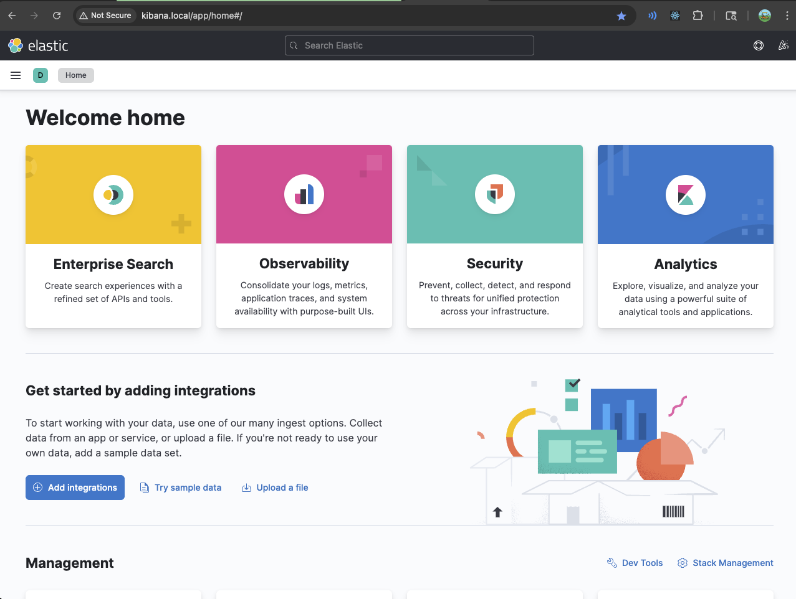

# Phase 2b: Ingress Controller Setup (Optional Enhancement)

This guide adds NGINX Ingress Controller to your local Kubernetes environment, providing production-like access to all services via local domains without port-forwarding.

## Prerequisites

- ✅ Phase 2 Complete (GitOps with monitoring and logging stacks)
- ✅ Services currently accessible via port-forwarding
- ✅ Git repository at `github.com/sojohnnysaid/k8s` with working ArgoCD sync

---

## Overview

### What This Phase Adds

Transform your local development experience by replacing manual port-forwarding with permanent local domain access:

| Service | Before (Port-Forward) | After (Ingress) |
|---------|----------------------|-----------------|
| ArgoCD | `kubectl port-forward` + https://localhost:8080 | http://argocd.local |
| Grafana | `kubectl port-forward` + http://localhost:3000 | http://grafana.local |
| Kibana | `kubectl port-forward` + http://localhost:5601 | http://kibana.local |
| Prometheus | `kubectl port-forward` + http://localhost:9090 | http://prometheus.local |

### Architecture

- **NGINX Ingress Controller**: Industry-standard ingress controller
- **K3s ServiceLB**: Built-in load balancer that exposes services on localhost
- **Host-based Routing**: Each service gets its own *.local domain
- **No Helm Required**: Raw Kubernetes manifests following our established pattern
- **Kustomize Organization**: Clean structure for deployment and management

---

## Implementation Steps

### Step 1: Navigate to Your K8s Repository

Switch to your GitOps repository where all manifests are stored.

```bash
cd ~/k8s
```

**Status:** Ready to proceed

---

### Step 2: Create Ingress Directory Structure

Set up organized directories for the ingress controller and resources.

**Create directories:**
```bash
mkdir -p ingress/nginx-controller
mkdir -p ingress/resources
```

**Expected structure:**
```
ingress/
├── nginx-controller/    # NGINX controller manifests
├── resources/          # Ingress resources for services
└── kustomization.yaml  # Root kustomization
```

**Status:** ✅ Complete

---

### Step 3: Deploy NGINX Ingress Controller Manifests

Create raw Kubernetes manifests for the NGINX ingress controller (no Helm required).

**Files to create:**
```
ingress/nginx-controller/
├── namespace.yaml           # ingress-nginx namespace
├── configmap.yaml          # Controller configuration
├── rbac.yaml              # RBAC permissions
├── ingressclass.yaml      # Default ingress class
├── deployment.yaml        # Controller deployment
├── service.yaml           # LoadBalancer service
├── admission-webhooks.yaml # Validation webhooks
└── kustomization.yaml     # Kustomize organization
```

**Key configurations:**
- **Service Type**: LoadBalancer (works with K3s ServiceLB)
- **Default IngressClass**: Set as default for all ingress resources
- **Resource Limits**: Optimized for local development
- **Version**: Using stable NGINX controller v1.10.0

**Apply the controller:**
```bash
kubectl apply -k ingress/nginx-controller/
```

**Verify deployment:**
```bash
kubectl get pods -n ingress-nginx
kubectl get svc -n ingress-nginx
```

**Expected output:**
```
NAME                                      READY   STATUS    RESTARTS   AGE
nginx-ingress-controller-xxxxx-xxxxx      1/1     Running   0          2m

NAME                       TYPE           CLUSTER-IP      EXTERNAL-IP   PORT(S)
ingress-nginx-controller   LoadBalancer   10.x.x.x       <pending>     80:xxxxx/TCP,443:xxxxx/TCP
```

**Note:** The EXTERNAL-IP showing `<pending>` is normal for K3s. The service is accessible on localhost.

**Status:** ✅ Complete

---

### Step 4: Configure ArgoCD for HTTP Mode

ArgoCD needs to run in insecure mode (HTTP) to work properly behind the ingress.

**Create configuration patch:**
```yaml
# ingress/resources/argocd-server-patch.yaml
apiVersion: v1
kind: ConfigMap
metadata:
  name: argocd-cmd-params-cm
  namespace: argocd
data:
  server.insecure: "true"
```

**Apply configuration:**
```bash
kubectl apply -f ingress/resources/argocd-server-patch.yaml
```

**Restart ArgoCD server:**
```bash
kubectl rollout restart deployment argocd-server -n argocd
```

**Wait for rollout:**
```bash
kubectl rollout status deployment argocd-server -n argocd
```

**Status:** ✅ Complete

---

### Step 5: Create Ingress Resources

Define ingress resources for each service with host-based routing.

**Files to create:**
```
ingress/resources/
├── argocd-ingress.yaml      # ArgoCD ingress
├── grafana-ingress.yaml     # Grafana ingress
├── kibana-ingress.yaml      # Kibana ingress
├── prometheus-ingress.yaml  # Prometheus ingress
└── kustomization.yaml       # Kustomize organization
```

**Example ingress resource (ArgoCD):**
```yaml
apiVersion: networking.k8s.io/v1
kind: Ingress
metadata:
  name: argocd-server-ingress
  namespace: argocd
  annotations:
    nginx.ingress.kubernetes.io/force-ssl-redirect: "false"
    nginx.ingress.kubernetes.io/backend-protocol: "HTTP"
spec:
  ingressClassName: nginx
  rules:
  - host: argocd.local
    http:
      paths:
      - path: /
        pathType: Prefix
        backend:
          service:
            name: argocd-server
            port:
              number: 80
```

**Apply all ingress resources:**
```bash
kubectl apply -k ingress/resources/
```

**Verify ingress creation:**
```bash
kubectl get ingress -A
```

**Expected output:**
```
NAMESPACE      NAME                    CLASS   HOSTS              PORTS   AGE
argocd         argocd-server-ingress   nginx   argocd.local       80      1m
monitoring     grafana-ingress         nginx   grafana.local      80      1m
elastic-stack  kibana-ingress          nginx   kibana.local       80      1m
monitoring     prometheus-ingress      nginx   prometheus.local   80      1m
```

**Status:** ✅ Complete

---

### Step 6: Configure Local DNS (/etc/hosts)

Map the local domains to localhost for browser access.

**Edit hosts file:**
```bash
sudo nano /etc/hosts
```

**Add these entries:**
```
127.0.0.1   argocd.local
127.0.0.1   kibana.local
127.0.0.1   grafana.local
127.0.0.1   prometheus.local
```

**Or use this one-liner:**
```bash
echo "127.0.0.1   argocd.local kibana.local grafana.local prometheus.local" | sudo tee -a /etc/hosts
```

**Verify DNS resolution:**
```bash
ping -c 1 argocd.local
```

**Expected output:**
```
PING argocd.local (127.0.0.1): 56 data bytes
64 bytes from 127.0.0.1: icmp_seq=0 ttl=64 time=0.xxx ms
```

**Status:** ✅ Complete

---

### Step 7: Test Service Access

Verify all services are accessible via their new ingress URLs.

**Test each service:**

1. **ArgoCD**: http://argocd.local
   - Should load ArgoCD login page
   - Username: `admin`
   - Password: `kubectl -n argocd get secret argocd-initial-admin-secret -o jsonpath="{.data.password}" | base64 -d`

2. **Grafana**: http://grafana.local
   - Should load Grafana login page
   - Username: `admin`
   - Password: `admin`

3. **Kibana**: http://kibana.local
   - Should load Kibana interface
   - No authentication required
   
   

4. **Prometheus**: http://prometheus.local
   - Should load Prometheus query interface
   - No authentication required

**Troubleshooting if services don't load:**
```bash
# Check ingress controller is running
kubectl get pods -n ingress-nginx

# Check ingress controller logs
kubectl logs -n ingress-nginx deployment/nginx-ingress-controller

# Verify ingress resources
kubectl describe ingress -A

# Check if port 80 is available
sudo lsof -i :80
```

**Status:** ✅ Complete

---

### Step 8: Organize with Kustomize

Create root kustomization files for easy deployment.

**Root kustomization.yaml:**
```yaml
# ingress/kustomization.yaml
apiVersion: kustomize.config.k8s.io/v1beta1
kind: Kustomization

resources:
  - nginx-controller
  - resources
```

This allows deploying everything with a single command:
```bash
kubectl apply -k ingress/
```

**Status:** ✅ Complete

---

### Step 9: Commit Changes to Git

Save your ingress configuration to the GitOps repository.

**Stage and commit:**
```bash
git add ingress/
git commit -m "feat: add NGINX ingress controller for local development

- NGINX ingress controller using raw K8s manifests (no Helm)
- Ingress resources for ArgoCD, Grafana, Kibana, Prometheus
- Host-based routing with *.local domains
- Eliminates need for port-forwarding
- Organized with Kustomize for easy deployment"

git push origin main
```

**Status:** ✅ Complete

---

## Migration from Port-Forwarding

### Comparison Table

| Aspect | Port-Forwarding (Phase 2) | Ingress (Phase 2b) |
|--------|---------------------------|-------------------|
| **Setup** | No additional setup | One-time ingress installation |
| **Access** | Run kubectl port-forward each time | Always available via URLs |
| **Multiple Services** | Multiple terminal windows | Single browser, multiple tabs |
| **Persistence** | Lost on terminal close | Persistent until cluster restart |
| **Production-like** | Development-only pattern | Mirrors production setup |
| **Sharing** | Difficult to share locally | Easy to share URLs |

### Stopping Port-Forward Sessions

If you have existing port-forward sessions running, you can stop them:

```bash
# Find port-forward processes
ps aux | grep port-forward

# Kill specific process
kill <PID>

# Or kill all port-forward processes
pkill -f port-forward
```

---

## Phase 2b Complete!

### Summary of Achievements

You have successfully enhanced your local development environment with:

| Component | Status | Details |
|-----------|--------|---------|
| **NGINX Ingress Controller** | ✅ | Deployed with raw K8s manifests |
| **Service Ingresses** | ✅ | All services accessible via *.local domains |
| **ArgoCD HTTP Mode** | ✅ | Configured for ingress compatibility |
| **Local DNS** | ✅ | /etc/hosts configured for local domains |
| **No Port-Forwarding** | ✅ | Services always accessible |
| **Production-like Access** | ✅ | Mirrors real-world ingress patterns |

### Quick Access Reference

All services are now permanently accessible at:

- **ArgoCD**: http://argocd.local (admin / [retrieve password])
- **Grafana**: http://grafana.local (admin / admin)
- **Kibana**: http://kibana.local (no auth)
- **Prometheus**: http://prometheus.local (no auth)

### Architecture Benefits

1. **Developer Experience**: No more managing port-forward sessions
2. **Production Parity**: Same ingress patterns as production
3. **Resource Efficiency**: Single ingress controller vs multiple port-forwards
4. **Maintainability**: Declarative configuration in Git
5. **Scalability**: Easy to add new services with ingress

### Next Steps

With Phase 2b complete, you have a fully enhanced local development environment. You can now:

- Access all services via browser-friendly URLs
- Focus on development without managing port-forwards
- Proceed to Phase 3: CI/CD Pipeline with GitHub Actions

### Useful Commands

**Check ingress controller status:**
```bash
kubectl get pods -n ingress-nginx
kubectl get svc -n ingress-nginx
```

**View all ingress resources:**
```bash
kubectl get ingress -A
```

**Restart ingress controller (if needed):**
```bash
kubectl rollout restart deployment/nginx-ingress-controller -n ingress-nginx
```

**Update ingress configurations:**
```bash
# Make changes in ingress/ directory
kubectl apply -k ingress/
```

**Add new service ingress:**
1. Create new ingress YAML in `ingress/resources/`
2. Add to `ingress/resources/kustomization.yaml`
3. Apply with `kubectl apply -k ingress/resources/`
4. Update /etc/hosts if using new domain

---

## Troubleshooting

### Services Not Accessible

**Check ingress controller:**
```bash
kubectl get pods -n ingress-nginx
kubectl logs -n ingress-nginx deployment/nginx-ingress-controller
```

**Verify ingress resources:**
```bash
kubectl get ingress -A
kubectl describe ingress <ingress-name> -n <namespace>
```

**Test connectivity:**
```bash
curl -H "Host: argocd.local" http://localhost
```

### Port 80/443 Already in Use

If another process is using ports 80 or 443:

```bash
# Find process using port 80
sudo lsof -i :80

# Stop the process or change its port
# Common culprits: Apache, nginx, Docker Desktop
```

### DNS Not Resolving

Verify /etc/hosts entries:
```bash
cat /etc/hosts | grep local
```

Clear DNS cache (macOS):
```bash
sudo dscacheutil -flushcache
```

### ArgoCD Still Redirecting to HTTPS

Ensure insecure mode is enabled:
```bash
kubectl get cm argocd-cmd-params-cm -n argocd -o yaml
kubectl rollout restart deployment argocd-server -n argocd
```

---

*Phase 2b Complete - Enhanced Local Development with Ingress Controller*